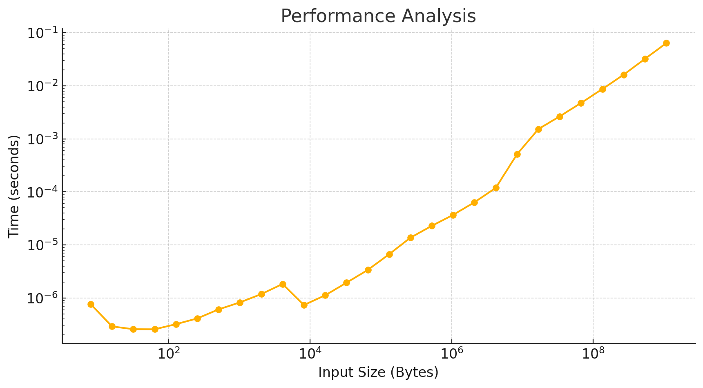
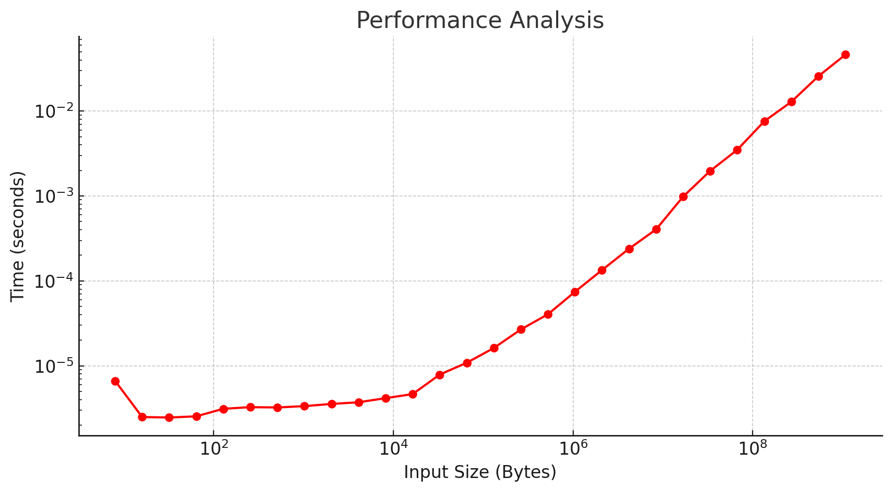

# Assingment III

## Excercise 1

### Questions

- Write the code in C. ✅
- How do you compile it? Which compiler and flags have you used, if any?
  We compile with:
  `cc -o e1.out e1.c`
- How do you run the MPI code on Dardel?
  We use sbatch to run the code, which we use like this:
  `sbatch srun -n 4 -o ./output.txt ./e1.out`
  `

## Excercise 2

### Questions

- Run the ping-pong benchmark for 1) and 2). After that, plot the ping-pong time in function of the message size in 1) and 2).

  1. intra-node communication (2 processes on the same node)

  

  2. inter-node communication (2 processes on different nodes)

  

- Using best fit (using Matlab, Python, or similar), calculate the bandwidth and latency for 1) and 2).
  Hint: if you obtain a negative number for latency, you can omit the ping-pong times for small message sizes. In fact, the measurements for small messages are quite noisy.`  
  **First dataset:**

  - Latency:
    96.607 microseconds
  - Bandwidth:
    16.739 GB/s

  **Second dataset:**

  - Latency:
    181.31 microseconds
  - Bandwidth:
    22.664 GB/s

## Excercise 3

- Assume periodic boundary conditions, e.g. the first and last process will communicate. Implement the communication for the 1D domain decomposition using
  - MPI blocking point-to-point communication.
    ✅
  - MPI non-blocking point-to-point communication.
    ✅
- Test the results by checking the correct values are on the ghost cells and the derivative of sin(x) on the edges of the domain is correct (the derivative of sin(x) is cos(x)). Show that your code produce the correct results (especially at the ghost cells).

  - By checking the output and error to a cos-function call, we can see that the results are correct.

- Why MPI_Send and MPI_Recv are called "blocking "communication?
  - It's called blocking communicationg since there is no wait time from the point of sending the data to receiving it, both processes wait until all data has been transfered, the alternative that is slowe would be having a local buffer that would act as middleware.
